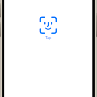

# Unlockly: a Biometric Authentication App

Welcome to **Unlockly**, a code-along project that shows you how to build a smooth and secure biometric authentication flow in SwiftUI — using **Swift Concurrency**.

This project combines Face ID / Touch ID with a responsive lockout system, modern async/await patterns, and a clean SwiftUI interface.

Whether you’re building a login screen or want to explore concurrency in action, this project is a perfect hands-on introduction.

  

The app will look like this:



## Overview

Unlockly guides you through building an authentication system with:

1. **Biometric Authentication**
    Using Apple’s LocalAuthentication framework with Face ID or Touch ID to verify users.
2. **Lockout Logic**
    After three failed attempts, the app locks the user out for a defined period (e.g. 5 minutes) — even across app restarts.
3. **Swift Concurrency**
    All logic runs on modern async/await and Task, keeping the UI smooth and responsive.

---

## **What You’ll Learn**

- How to use LAContext to access biometric authentication.
- How to build a countdown and lockout mechanism using Swift Concurrency.
- How to manage authentication state with `@ObservableObject`, `@Published`, and SwiftUI state-driven views.
- How to structure reusable authentication logic in an AuthenticationManager.


## Getting Started

### **Prerequisites**

- **Xcode 15 or later**
- **iOS 16 or later**
    (For Swift Concurrency and biometric API support)

### Setup

1. Clone the Repository:
   ```bash
   git clone https://github.com/yourusername/Unlockly.git
   cd Unlockly
   ```
2. 2. Open the Project:
    Open Unlockly.xcodeproj in Xcode.
3. Run the App:
    Choose a simulator or device that supports Face ID / Touch ID and press **Cmd + R**.

## Code-Along Walkthrough

### AuthenticationManager.swift

- A `@MainActor` class that drives all logic.
- Handles:
    - Authentication attempts via LAContext
    - Tracking authentication state (.start, .success, .failure, .locked)
    - Lockout after 3 failed attempts using UserDefaults
    - Countdown timer with Task.sleep(for:)

### ContentView.swift

- Central SwiftUI view that reacts to the authentication state.
- Shows different screens based on state:
    - AuthenticationView → for biometric input
    - PasswordView → if authentication fails
    - LockedView → if too many failures occur
    - UnlockedView → on success

### Supporting Views

- AuthenticationView.swift
    Displays a Face ID button that triggers the authentication flow.
- PasswordView.swift
    Shows a retry button and remaining attempts after failed authentication.
- LockedView.swift 
    Shows a countdown timer during the lockout phase.
- UnlockedView.swift 
    Confirms successful login.

---

## Swift Concurrency in Action

Unlockly uses modern Swift Concurrency throughout:
- `async/await` for non-blocking biometric checks.
- `Task` to launch concurrent operations.
- `Task.sleep(for:)` for countdowns — replacing legacy Timer.

This makes the app feel modern, responsive, and easier to reason about.

---

## Resources

- [Apple Developer Documentation – LocalAuthentication](https://developer.apple.com/documentation/localauthentication)
- [Swift Concurrency Guide](https://developer.apple.com/documentation/swift/swift_concurrency)
- [WWDC: Meet async/await in Swift](https://developer.apple.com/videos/play/wwdc2021/10132/)

## License

This project is licensed under the MIT License. See the LICENSE file for details.

---

Happy coding!

Let your curiosity guide you — and unlock new skills with Swift. ✨